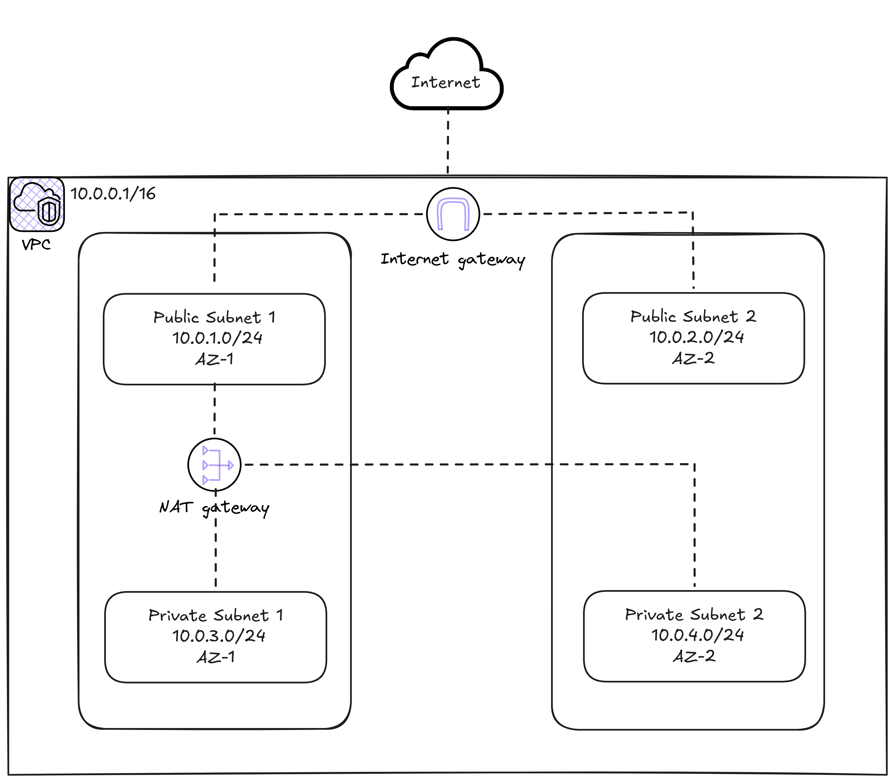

# Lab 01: VPC Networking

## Objective

Create a production-ready VPC from scratch with public and private subnets, internet gateway, NAT gateway, route tables, NACLs and security groups. This is the network foundation on which we will build the rest of the labs.

## Architecture Diagram




Route Table (Public)
| Source  | Destination |
|---------|-------|
| 10.0.0.0/16 | local |
| 0.0.0.0/0 | IGW |
Route Table (Private)
| Source  | Destination |
|---------|-------|
| 10.0.0.0/16 | local |
| 0.0.0.0/0 | NAT GW |

## Deployment Steps

### 1. Initialize and apply

```bash
cd 01-vpc-networking

# Initialize (configure remote backend)
terraform init

# Review what will be created
terraform plan

# Apply
terraform apply
```

### 2. Verify the infrastructure

```bash
# Verify VPC
aws ec2 describe-vpcs --filters "Name=tag:Lab,Values=01-vpc-networking"

# Verify subnets
aws ec2 describe-subnets --filters "Name=tag:Lab,Values=01-vpc-networking"

# Verify Internet Gateway
aws ec2 describe-internet-gateways --filters "Name=tag:Lab,Values=01-vpc-networking"

# Verify NAT Gateway
aws ec2 describe-nat-gateways --filter "Name=tag:Lab,Values=01-vpc-networking"

# Verify Route Tables
aws ec2 describe-route-tables --filters "Name=tag:Lab,Values=01-vpc-networking"
```

### 3. Check connectivity (optional)

Launch an EC2 instance in the public subnet and another in the private subnet. Verify that:
- The public instance has internet access
- The private instance can reach the internet (through the NAT Gateway) but is not accessible from outside

---

## Estimated Cost

| Resource | Cost |
|---------|-------|
| VPC, Subnets, IGW, Route Tables | Free |
| NAT Gateway | ~$0.048/hour (~$1.15/day) |
| NAT Gateway data processing | $0.048/GB |
| Elastic IP (associated with NAT) | Free (while associated) |

> **Estimated total: ~$1/day** mainly due to the NAT Gateway. Remember to run `terraform destroy` when you are not practicing.

## Cleanup

```bash
terraform destroy
```

> **Important:** Always destroy resources when you finish practicing to avoid unnecessary costs. The NAT Gateway charges per hour.

## File Structure

```
01-vpc-networking/
  main.tf          # Main resources (VPC, subnets, gateways, route tables, NACLs, SGs)
  variables.tf     # Input variables
  outputs.tf       # Output values
  backend.tf       # Remote backend configuration (S3)
  README.md        # This file
```
