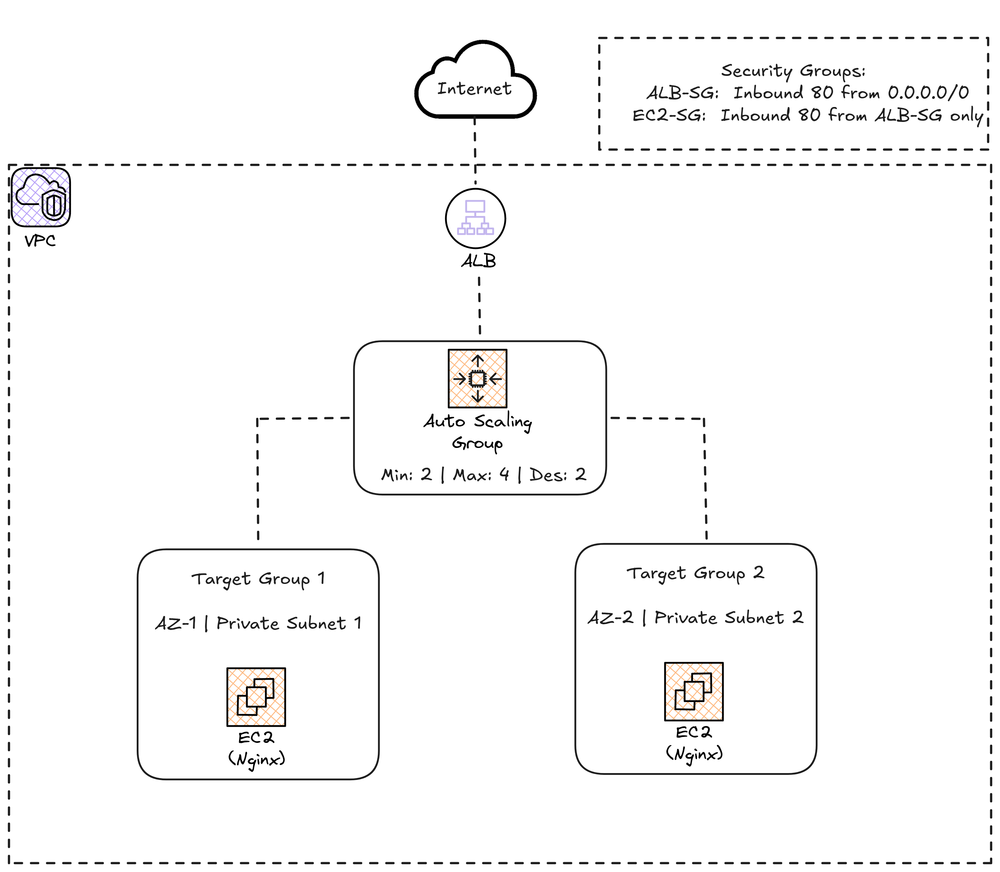

# Lab 02: Web Server with High Availability

## Objective

Deploy a web server with high availability using an Application Load Balancer (ALB) with Auto Scaling Group (ASG) and EC2 instances in private subnets. This pattern is fundamental for any production web application.

## Architecture



## Prerequisites

- Lab 00 completed (remote backend)
- Lab 01 completed (VPC and subnets)

## Deployment Steps

### 1. Verify that Lab 01 is deployed

```bash
cd 01-vpc-networking
terraform output
# You should see VPC ID, subnet IDs, etc.
```

### 2. Deploy the web server

```bash
cd 02-web-server

# Initialize
terraform init

# Review the plan
terraform plan

# Apply
terraform apply
```

### 3. Verify the ALB

```bash
# Get the ALB DNS name
terraform output alb_dns_name

# Access from browser or curl
curl http://$(terraform output -raw alb_dns_name)
```

You should see an HTML page showing the instance ID and the Availability Zone. If you refresh several times, you will see how traffic is distributed across the instances.

### 4. Test Scaling

```bash
# Check current instances
aws autoscaling describe-auto-scaling-groups \
  --auto-scaling-group-names $(terraform output -raw asg_name)

# To test scaling, you can generate load with tools like:
# ab -n 100000 -c 100 http://<alb-dns>/
# or use stress-ng on the instances
```

---

## Estimated Cost

| Resource | Cost |
|---------|-------|
| ALB | ~$0.0252/hour (~$0.60/day) |
| EC2 t3.micro x2 | ~$0.0116/hour x2 (~$0.56/day) |
| NAT Gateway (from Lab 01) | ~$1.15/day |
| Data transfer | Variable |

> **Estimated total: ~$2-3/day.** Remember to run `terraform destroy` when you are not practicing.

## Cleanup

```bash
# Destroy this lab first
terraform destroy

# Then you can destroy Lab 01 if you no longer need it
cd ../01-vpc-networking
terraform destroy
```

## File Structure

```
02-web-server/
  main.tf          # ALB, ASG, Launch Template, Security Groups
  variables.tf     # Input variables
  outputs.tf       # Output values
  backend.tf       # Remote backend configuration
  user_data.sh     # Instance initialization script
  README.md        # This file
```
