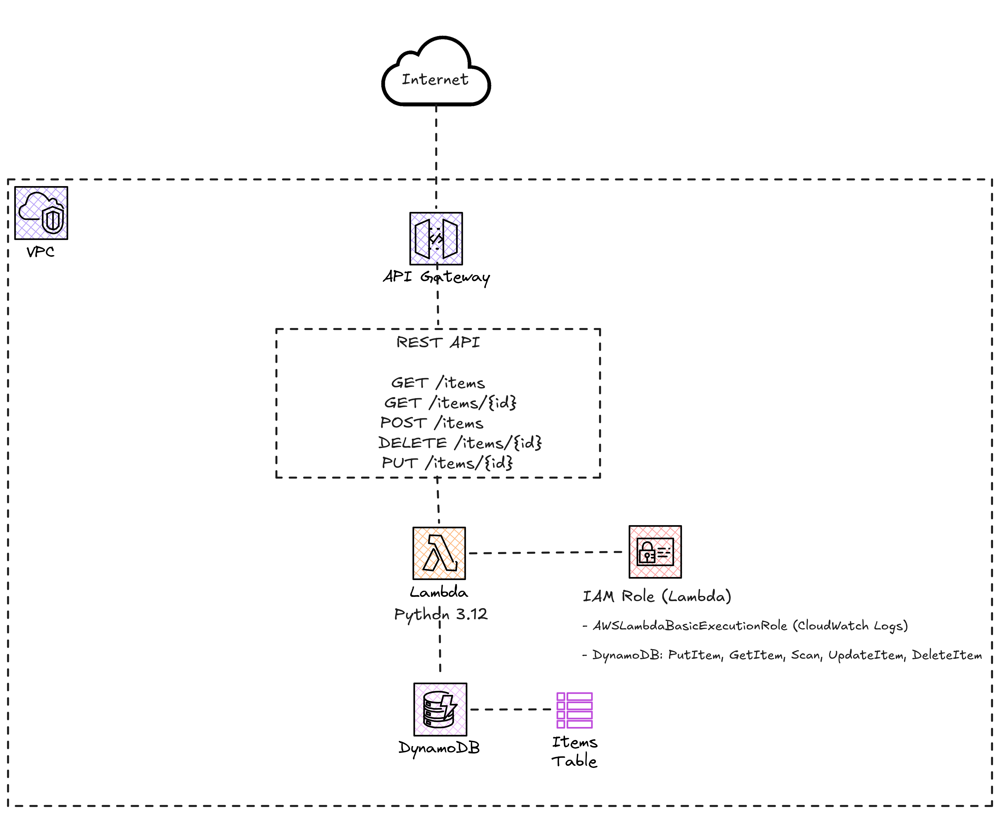

# Lab 03: Serverless REST API

## Objective

Build a complete serverless REST API with CRUD operations using API Gateway, Lambda and DynamoDB. This pattern is one of the most common in modern AWS architectures.

## Architecture



## Prerequisites

- Lab 00 completed (remote backend)

## CRUD Operations

| Method | Endpoint | Description |
|--------|----------|-------------|
| GET | /items | List all items |
| POST | /items | Create a new item |
| GET | /items/{id} | Get an item by ID |
| PUT | /items/{id} | Update an item |
| DELETE | /items/{id} | Delete an item |

## Deployment Steps

### 1. Deploy the infrastructure

```bash
cd 03-serverless-api

# Initialize
terraform init

# Review the plan
terraform plan

# Apply
terraform apply
```

### 2. Get the API URL

```bash
export API_URL=$(terraform output -raw api_gateway_invoke_url)
echo $API_URL
```

### 3. Test with curl

```bash
# Create an item
curl -X POST "$API_URL/items" \
  -H "Content-Type: application/json" \
  -d '{"name": "My first item", "description": "Created from lab 03"}'

# List all items
curl "$API_URL/items" | jq .

# Get an item by ID (replace <id> with the ID of the created item)
curl "$API_URL/items/<id>" | jq .

# Update an item
curl -X PUT "$API_URL/items/<id>" \
  -H "Content-Type: application/json" \
  -d '{"name": "Updated item", "description": "Modified"}'

# Delete an item
curl -X DELETE "$API_URL/items/<id>"
```

---

## Estimated Cost

| Resource | Cost |
|---------|-------|
| Lambda | Free Tier: 1M requests + 400,000 GB-sec/month |
| API Gateway | Free Tier: 1M requests/month (12 months) |
| DynamoDB (On-Demand) | Free Tier: 25 WCU + 25 RCU |

> **Estimated total: Free** within the Free Tier for lab usage. Perfect for practicing without costs.

## Cleanup

```bash
terraform destroy
```

## File Structure

```
03-serverless-api/
  main.tf              # DynamoDB, Lambda, API Gateway, IAM
  variables.tf         # Input variables
  outputs.tf           # Output values
  backend.tf           # Remote backend configuration
  lambda/
    handler.py         # Python Lambda handler code
  README.md            # This file
```
