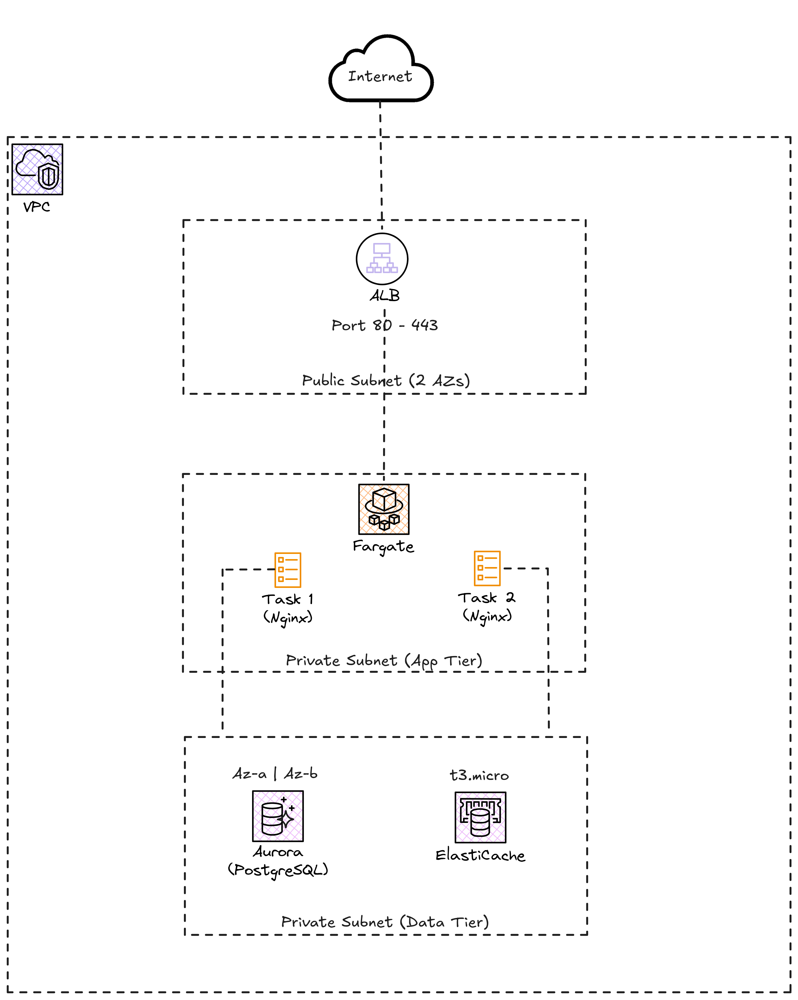

# Lab 04: Three-Tier Architecture on AWS

## Objective

Deploy a classic three-tier architecture on AWS using managed services and containers. This architecture is the foundation of most enterprise web applications.

## Architecture




## Deployed Components

| Component | AWS Service | Tier |
|---|---|---|
| Load balancer | ALB | Public |
| Application | ECS Fargate (nginx) | Private |
| Database | Aurora PostgreSQL Serverless v2 | Private |
| Cache | ElastiCache Redis | Private |
| Logs | CloudWatch Log Group | - |

## Security Groups (security layers)

```
Internet --> ALB SG (80/443) --> ECS SG (80) --> Aurora SG (5432)
                                       |
                                       +--> Redis SG (6379)
```

- **ALB SG**: allows inbound traffic on ports 80 and 443 from any IP
- **ECS SG**: allows inbound traffic on port 80 only from the ALB SG
- **Aurora SG**: allows inbound traffic on port 5432 only from the ECS SG
- **Redis SG**: allows inbound traffic on port 6379 only from the ECS SG

## Prerequisites

- Lab 01 (VPC Networking) deployed (remote state is used to obtain VPC and subnets)
- AWS CLI configured
- Terraform >= 1.0

## Deployment

```bash
terraform init
terraform plan
terraform apply
```

## Estimated Cost

**~$5-8/day** when resources are active.

| Service | Approximate cost |
|---|---|
| Aurora Serverless v2 (0.5 ACU min) | ~$2-4/day |
| ElastiCache Redis (cache.t3.micro) | ~$0.50/day |
| ALB | ~$0.60/day |
| ECS Fargate (2 tasks) | ~$1-2/day |
| CloudWatch Logs | ~$0.10/day |

## IMPORTANT: Destroy when finished

Aurora and ElastiCache generate significant costs even when idle. **Destroy resources when you are done**:

```bash
terraform destroy
```

Verify in the AWS console that all resources have been properly deleted, especially:
- Aurora cluster and its instances
- ElastiCache cluster
- Application Load Balancer
