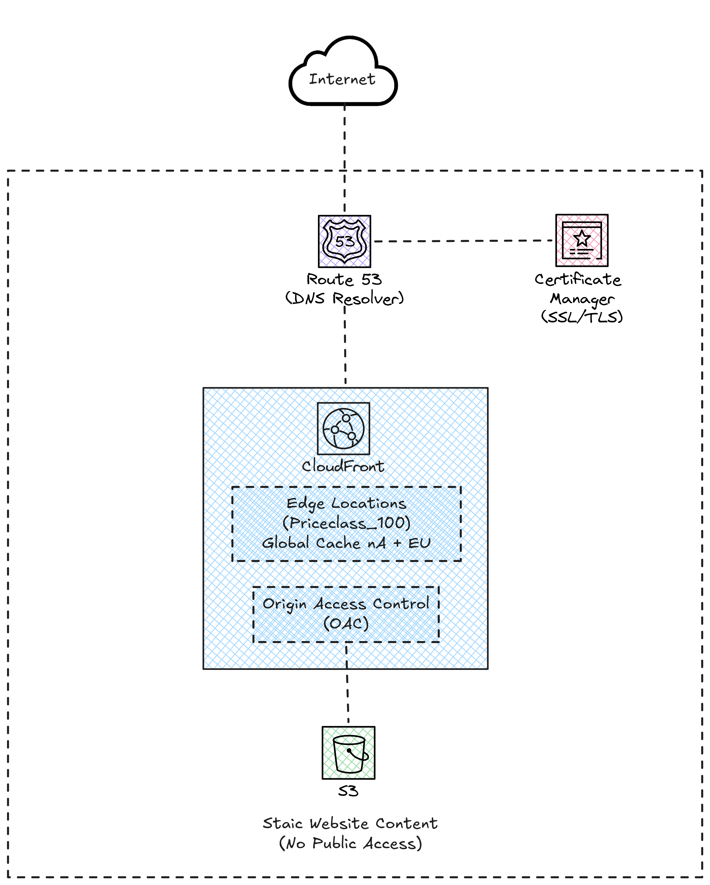

# Lab 05: Static Website Hosting with CloudFront and S3

## Objective

Deploy a static website with global distribution using Amazon S3 as the origin and CloudFront as the CDN. This pattern is fundamental for understanding how AWS serves static content securely, quickly and economically.

## Architecture



## Deployed Components

| Component | AWS Service | Notes |
|---|---|---|
| Storage | S3 Bucket | Public access blocked |
| CDN | CloudFront Distribution | PriceClass_100 (NA + EU) |
| Secure access | CloudFront OAC | Replaces OAI (legacy) |
| SSL Certificate | ACM | Optional, in us-east-1 |
| DNS | Route 53 | Optional, requires domain |

## Note about the domain

The Route 53 domain is **optional**. Without a custom domain, you can access the site directly through the CloudFront domain (e.g., `d1234abcd.cloudfront.net`).

If you want to use a custom domain:
1. Register or transfer a domain to Route 53 (~$12/year for `.com`)
2. Uncomment the ACM and Route 53 sections in `main.tf`
3. Configure the `domain_name` variable

## Prerequisites

- AWS CLI configured
- Terraform >= 1.0

## Deployment

```bash
terraform init
terraform plan
terraform apply
```

After deployment, access the CloudFront URL shown in the outputs.

## Estimated Cost

**~$0.50/month** (mainly S3 storage).

| Service | Approximate cost |
|---|---|
| S3 (storage) | ~$0.02/month |
| CloudFront (transfer) | Free Tier: 1 TB/month |
| Route 53 (hosted zone) | $0.50/month (if used) |
| Domain | ~$12/year (if purchased) |
| ACM | Free |

This lab is very economical and can be left active without worrying about high costs.
