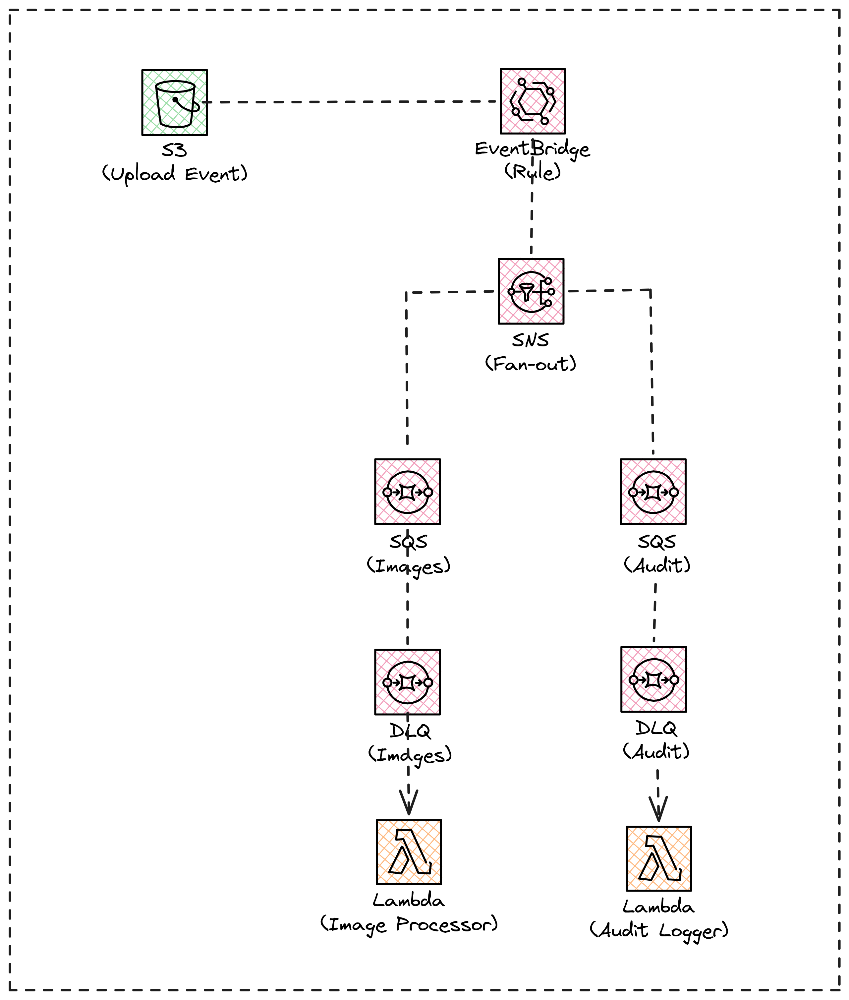
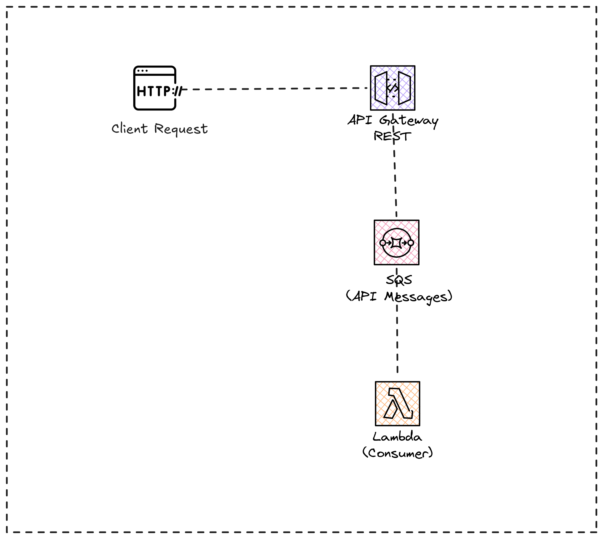

# Lab 06: Event-Driven Architecture

## Objective

Build an event-driven architecture with total decoupling between components, using AWS messaging and event patterns. This lab covers the most important design patterns for the exam: fan-out, dead-letter queues, direct service integration and asynchronous processing.

## Architecture

| FLOW 1  | FLOW 2  |
| :---: | :---: |
|  |  |
| S3 Event Processing | API Gateway -> SQS (direct integration) |


## Deployed Components

| Component | AWS Service | Function |
|---|---|---|
| Storage | S3 Bucket | Event source (uploads) |
| Event bus | EventBridge Rule | Captures PutObject events from S3 |
| Distribution | SNS Topic | Fan-out to multiple queues |
| Processing queue | SQS Queue (images) | Queue for image processing |
| Audit queue | SQS Queue (audit) | Queue for audit logging |
| Error queues | SQS DLQ x2 | Dead-letter queues for failed messages |
| Processors | Lambda x2 | Message consumers |
| API | API Gateway | HTTP entry point directly to SQS |

## Design Patterns Covered

1. **Fan-out pattern**: one event generates multiple actions in parallel
2. **Dead-letter queue pattern**: error handling without losing messages
3. **Service integration pattern**: API Gateway integrates directly with SQS without Lambda
4. **Event sourcing**: S3 as event source via EventBridge

## Prerequisites

- AWS CLI configured
- Terraform >= 1.0

## Deployment

```bash
terraform init
terraform plan
terraform apply
```

## Testing

### Flow 1: Upload file to S3
```bash
# Create a test file and upload it to the bucket
echo "test content" > test.txt
aws s3 cp test.txt s3://$(terraform output -raw s3_bucket_name)/test.txt

# Check the Lambda function logs
aws logs tail /aws/lambda/event-driven-dev-image-processor --follow
aws logs tail /aws/lambda/event-driven-dev-audit-logger --follow
```

### Flow 2: Send message via API Gateway
```bash
# Send a message directly to the queue via API Gateway
curl -X POST $(terraform output -raw api_endpoint)/messages \
  -H "Content-Type: application/json" \
  -d '{"message": "test event from API"}'
```

## Estimated Cost

**Free Tier** - All services used are within the AWS Free Tier:

| Service | Free Tier |
|---|---|
| S3 | 5 GB storage |
| EventBridge | Free for AWS service events |
| SNS | 1 million publications/month |
| SQS | 1 million requests/month |
| Lambda | 1 million invocations/month |
| API Gateway | 1 million API calls/month |
