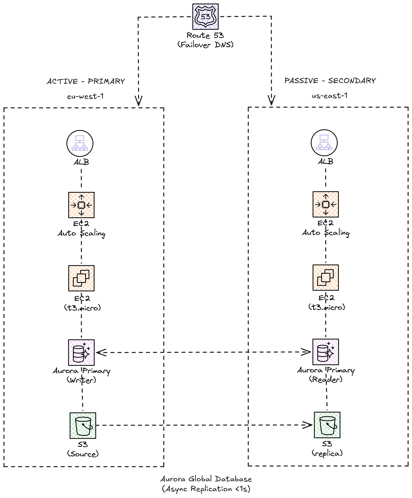

# Lab 08: Multi-Region High Availability with Automatic Failover

## Objective

Design and deploy a multi-region architecture with automatic failover using Route53, Aurora Global Database and S3 Cross-Region Replication.

## Architecture



## Disaster Recovery Strategies

| Strategy | RPO | RTO | Cost | This Lab |
|------------|-----|-----|-------|----------|
| Backup & Restore | Hours | Hours | $ | No |
| Pilot Light | Minutes | Minutes | $$ | No |
| Warm Standby | Seconds | Minutes | $$$ | **Yes** |
| Multi-Site Active/Active | ~0 | ~0 | $$$$ | No |

This lab implements **Warm Standby**: minimal active infrastructure in the secondary region, ready to scale.

## Deployed Components

| Resource | Primary Region | Secondary Region |
|---------|---------------|-----------------|
| VPC + Subnets | eu-west-1 | us-east-1 |
| ALB | eu-west-1 | us-east-1 |
| ASG (t3.micro, min 1) | eu-west-1 | us-east-1 |
| Aurora Cluster | Writer | Read Replica |
| S3 Bucket | Source | CRR Replica |
| Route53 Health Check | Primary ALB | - |
| Route53 Failover | Primary record | Secondary record |

## Estimated Cost

**~$8-12/day** (duplicated infrastructure in two regions)

> **IMPORTANT**: This lab is expensive due to having active infrastructure in two regions. **DESTROY THE INFRASTRUCTURE AS SOON AS YOU FINISH**.

## How to Deploy

```bash
# Initialize Terraform
terraform init

# View the plan (observe resources in both regions)
terraform plan

# Deploy
terraform apply

# IMPORTANT: Destroy when finished
terraform destroy
```

## Testing Failover

1. **Verify that DNS resolves to the primary region**:
   ```bash
   dig +short your-domain.example.com
   ```

2. **Simulate failure** (stop instances in the primary region):
   ```bash
   # The Route53 health check will detect the failure
   # It will automatically redirect traffic to the secondary region
   ```

3. **Verify failover**:
   ```bash
   # Wait ~60 seconds for Route53 to detect the failure
   dig +short your-domain.example.com
   # Should resolve to the secondary ALB IP
   ```

## Cleanup

```bash
# DESTROY IMMEDIATELY when finished
terraform destroy
```

> **Warning**: Verify in the AWS console that all resources have been deleted in BOTH regions.
